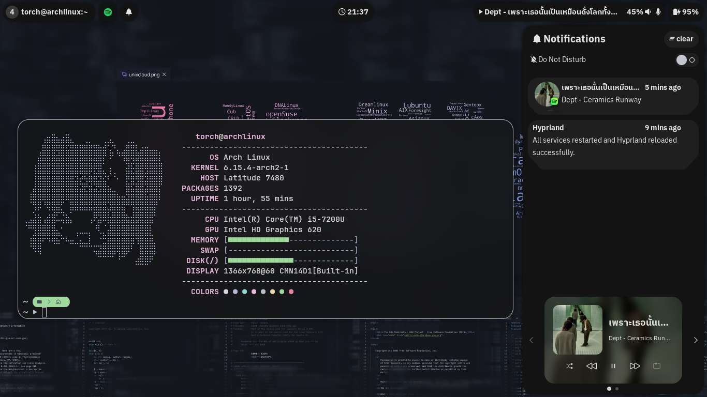

  <h1>【 FewlyTorch's Hyprland dotfiles 】</h1>

<i>you can use this dots but you have to config it to make it work with your devices.</i>

  <h2>⬧ All I Use ⬧</h2>

- WM : [Hyprland](https://hypr.land/)
- Color Palette : [Matugen](https://github.com/InioX/matugen) & [Catppuccin Mocha](https://catppuccin.com)
- Status bar : [Waybar](https://github.com/Alexays/Waybar)
- Application launcher/Dmenu replacer: [Rofi](https://github.com/davatorium/rofi)
- Wallpaper manager: [Swww](https://github.com/LGFae/swww)
- Notif Daemon: [Swaync](https://github.com/ErikReider/SwayNotificationCenter)
- Power menu: [Wlogout](https://github.com/ArtsyMacaw/wlogout)
- [Hypr Ecosystem](https://wiki.hyprland.org/Hypr-Ecosystem):
    - [Hyprlock](https://wiki.hyprland.org/Hypr-Ecosystem/hyprlock): lock screen
    - [Hypridle](https://wiki.hyprland.org/Hypr-Ecosystem/hypridle/): do things when you idle
    - [Hyprpicker](https://wiki.hyprland.org/Hypr-Ecosystem/hyprpicker/): color picker
    - [Hyprsunset](https://wiki.hyprland.org/Hypr-Ecosystem/hyprsunset/): nightlight
- Misc:
    - [Hyprshot](https://github.com/Gustash/Hyprshot): screenshot tool

  <h2>⬧ Reference ⬧</h2>

- [**Rexcrazy804**](https://github.com/Rexcrazy804/Zaphkiel)
- [**end 4**](https://github.com/end-4/dots-hyprland)
- [**linkfrg**](https://github.com/linkfrg/dotfiles)
- [**Reyshyram**](https://github.com/Reyshyram/Dotfiles/tree/old-arch)
- **Material Design** 3
- **Libawaita** apps

  <h2>⬧ Preview (*out dated!*) ⬧</h2>

  <h2>⬧ Todo ⬧</h2>

- [ ] Setting using `rofi`
- [ ] Better start up workflow
